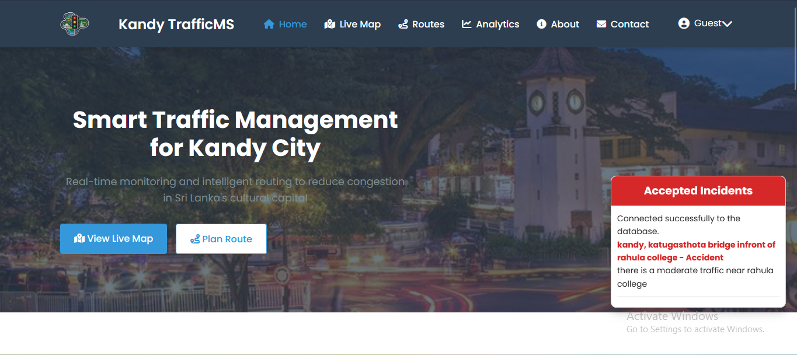

# Optimized Traffic Management and Analytics System

This project is developed as part of the Final Year Project for the Higher National Diploma in Management Information Systems at the National Institute of Business Management (NIBM), Kandy.

> ⚠️ **Note:** This repository is a **restructured version** of the original project.  
> 🔗 [Original GitHub Repository](https://github.com/Deshmiga21/Traffic-Management-System)  
> 🎥 [Project Video – Website Demonstration](https://drive.google.com/file/d/1LAJKkGejyDM668U6iPMAInNG942ildTa/view?usp=sharing)

## 🖼️ Website Home Page

 <!-- Place your image in an 'images' folder within the repo -->

## 📍 Project Overview

The **Optimized Traffic Management and Analytics System** is a comprehensive platform aimed at mitigating traffic congestion in urban areas, specifically Kandy, Sri Lanka. The system enhances traffic monitoring, real-time incident reporting, and decision-making through analytics, ultimately promoting safer and more efficient urban mobility.

## 👥 Team Members

- A. Deshmiga – KAHNDISM241F-002  
- D.H.A. Goonasekere – KAHNDISM241F-015  
- T.G.N.D. Jayasinghe – KAHNDISM241F-016  
- A.M. Weerasinghe – KAHNDISM241F-018  

## 🛠️ Technologies Used

### Frontend
- HTML, CSS, JavaScript  
- Figma (Design & Prototyping)

### Backend
- PHP, Python

### Database
- MySQL, PL/SQL

### Data Visualization & Analytics
- Power BI, Tableau

### Tools
- Git & GitHub (Version Control)  
- Jenkins (Automation)  
- Trello (Project Management)  
- Microsoft Teams (Communication)  
- Google Maps API & OpenStreetMap (Navigation)  
- Visual Studio Code (IDE)

## 📊 System Features

- Real-time traffic condition monitoring  
- Incident reporting by users  
- Route optimization & alternate path suggestions  
- Traffic predictions using historical data  
- Integrated dashboard for authorities and admin users  
- Public transportation data integration  
- User feedback and report generation

## ⚙️ Methodology

Agile development methodology was followed, including:

- Sprint-based development
- Continuous user feedback integration
- Iterative testing and deployments
- Collaborative tools like Trello and Microsoft Teams

## 📂 Project Modules

- **Admin Panel** – Manage users, data validation, and report generation  
- **Driver Interface** – View traffic, report incidents, and request alternate routes  
- **Authority Panel** – Monitor congestion and access planning insights  
- **Analytics Dashboard** – Visual representation of traffic patterns  
- **Incident Management** – Logging and resolving road-related events  
- **Traffic Prediction** – Statistical models to predict congestion

## 💡 Future Enhancements

- Integration of AI and Machine Learning  
- Edge computing for decentralized processing  
- Smart infrastructure and V2I (vehicle-to-infrastructure) communication  
- Personalized user experiences and alerts  
- Environmental and sustainability metrics tracking

## 🔐 Security & Privacy

The system emphasizes secure data handling and user authentication. Considerations for regulatory compliance (data privacy, system integrity) have been acknowledged.

## 📎 Reference Links

- [Trello Board](https://trello.com/b/jDnZvcCw/traffic-optimization-system)

